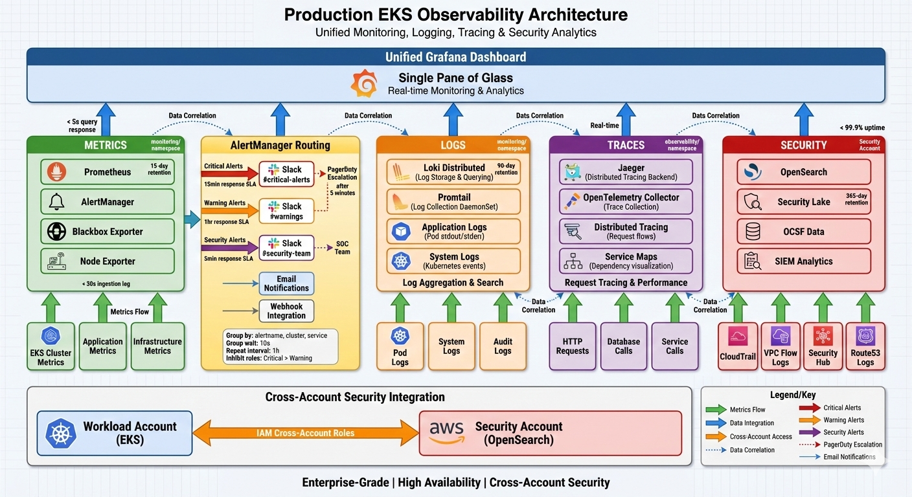

# Production Observability Stack

## 🎯 Overview

This production-grade observability stack provides comprehensive monitoring, logging, tracing, and security analytics for the EKS cluster `pilotgab-prod`. The stack implements the **four pillars of observability** with enterprise-grade reliability, security, and scalability.

## 🏗️ Architecture Diagram



_Complete observability architecture showing unified Grafana dashboard, four pillars of observability (Metrics, Logs, Traces, Security), AlertManager routing with severity-based Slack notifications, and cross-account security integration._

### Unified Observability Architecture

The architecture above illustrates our comprehensive observability platform with:

- **Unified Grafana Dashboard** - Single pane of glass for all observability data
- **Four Pillars Integration** - Metrics (Prometheus), Logs (Loki), Traces (Jaeger), Security (OpenSearch)
- **AlertManager Routing** - Severity-based alert routing to Slack channels with SLA-driven escalation
- **Cross-Account Security** - Secure integration with Security Lake for SIEM capabilities
- **Enterprise Features** - High availability, encryption, compliance-ready configuration

## 📊 Stack Components

### 1. **Metrics Collection & Monitoring**

#### **Prometheus Stack (kube-prometheus-stack)**

- **Version**: 80.13.3
- **Namespace**: `monitoring`
- **Components**:
  - **Prometheus**: Time-series metrics database with 15-day retention
  - **Grafana**: Unified visualization and dashboarding platform
  - **AlertManager**: Alert routing and notification management
  - **Node Exporter**: Host-level metrics collection
  - **Kube State Metrics**: Kubernetes object state metrics

**Key Features:**

- ✅ High Availability (2 Prometheus replicas, 3 AlertManager replicas)
- ✅ Persistent storage with encrypted EBS volumes (gp3-kms)
- ✅ Security hardening (non-root, read-only filesystem)
- ✅ Pod Disruption Budgets for resilience
- ✅ Resource limits and requests for stability

#### **Blackbox Exporter**

- **Version**: 11.7.0
- **Purpose**: External endpoint monitoring and synthetic checks
- **Capabilities**: HTTP, TCP, DNS, and ICMP probes

### 2. **Logging Infrastructure**

#### **Loki Distributed**

- **Version**: 0.80.6
- **Namespace**: `monitoring`
- **Architecture**: Distributed deployment for scalability
- **Storage**: AWS S3 backend with 90-day retention

**Components:**

- **Distributor**: Log ingestion and load balancing (3 replicas)
- **Querier**: Log query processing (3 replicas)
- **Compactor**: Log compaction and retention management
- **Ingester**: Log indexing with persistent WAL storage

#### **Promtail**

- **Version**: 6.17.1
- **Deployment**: DaemonSet on all nodes
- **Collection Sources**:
  - Kubernetes pod logs
  - System journal logs
  - Host system logs (/var/log)

### 3. **Distributed Tracing**

#### **Jaeger**

- **Version**: 2.57.0
- **Namespace**: `observability`
- **Storage**: AWS Elasticsearch backend
- **Components**:
  - **Collector**: Trace ingestion and processing
  - **Query**: Trace query interface and UI

#### **OpenTelemetry Collector**

- **Version**: 0.143.0
- **Purpose**: Unified telemetry data collection and processing
- **Deployment**: 2 replicas for high availability
- **Integration**: Routes traces to Jaeger

### 4. **Security Analytics & SIEM** 🆕

#### **OpenSearch Integration**

- **Purpose**: Security Lake data analytics and SIEM capabilities
- **Data Sources**: OCSF-normalized security data from AWS Security Lake
- **Access**: Cross-account integration with security account
- **Integration**: Native Grafana data source for unified dashboards

**Security Data Sources:**

- **CloudTrail**: API activity monitoring (OCSF class: API Activity)
- **VPC Flow Logs**: Network traffic analysis (OCSF class: Network Activity)
- **Security Hub**: Security findings aggregation (OCSF class: Security Finding)
- **Route53**: DNS query monitoring (OCSF class: DNS Activity)
- **Custom Sources**: Terraform state access, application security events

## 🚀 Deployment Architecture

### **Namespace Organization**

```
monitoring/          # Core monitoring infrastructure
├── prometheus
├── grafana          # 🆕 Now includes OpenSearch data sources
├── alertmanager
├── loki-distributed
├── promtail
└── blackbox-exporter

observability/       # Tracing and advanced observability
├── jaeger
└── otel-collector
```

### **Enhanced Data Flow** 🆕

```
Applications → Metrics → Prometheus → Grafana
            ↓
            Logs → Promtail → Loki → Grafana
            ↓
            Traces → OTel Collector → Jaeger → Grafana
            ↓
Security Events → Security Lake → OpenSearch → Grafana
```

## 📈 Key Metrics and Dashboards

### **Infrastructure Metrics**

- **Cluster Health**: Node status, resource utilization, pod states
- **Application Performance**: Request rates, error rates, response times
- **Resource Usage**: CPU, memory, disk, network utilization
- **Kubernetes Objects**: Deployments, services, ingress status

### **Security Analytics** 🆕

- **Security Events**: Real-time OCSF security event monitoring
- **Threat Detection**: Failed authentications, network anomalies
- **Compliance Monitoring**: Infrastructure access tracking
- **Incident Investigation**: Correlated security and application events

### **Unified Dashboards** 🆕

- **EKS Cluster Overview**: Comprehensive cluster health + security events
- **Application Performance**: Service-level metrics + security context
- **Security Overview**: OCSF security events, failed auths, network anomalies
- **Terraform State Access**: Infrastructure access monitoring and auditing
- **Incident Response**: Correlated metrics, logs, traces, and security events

### **Data Sources in Grafana**

1. **Prometheus** - Infrastructure and application metrics
2. **Loki** - Application and Kubernetes logs
3. **Jaeger** - Distributed tracing data
4. **OpenSearch-SecurityLogs** - Security Lake OCSF data 🆕
5. **OpenSearch-AppLogs** - Application security events 🆕

## 🔐 Security Configuration

### **Authentication & Authorization**

- **Grafana**: Basic auth with secure password management
- **RBAC**: Kubernetes role-based access control
- **Service Accounts**: Dedicated accounts with minimal permissions
- **Cross-Account Access**: Secure IAM role assumption for OpenSearch 🆕

### **Network Security**

- **Network Policies**: Restricted inter-pod communication
- **TLS**: Encrypted communication between components
- **Ingress**: Secure external access configuration
- **Cross-Account**: Secure role-based access to security account 🆕

### **Data Security**

- **Encryption at Rest**: KMS-encrypted persistent volumes
- **IAM Roles**: AWS IAM roles for service accounts (IRSA)
- **Secrets Management**: Kubernetes secrets for sensitive data
- **SigV4 Authentication**: AWS native authentication for OpenSearch 🆕

## 📊 Storage and Retention

### **Prometheus Storage**

- **Volume**: 100Gi encrypted EBS (gp3-kms)
- **Retention**: 15 days
- **Compression**: WAL compression enabled

### **Loki Storage**

- **Backend**: AWS S3 bucket (`loki-prod-logs`)
- **Retention**: 2160 hours (90 days)
- **Indexing**: BoltDB shipper with 24h index period

### **Grafana Storage**

- **Volume**: 20Gi encrypted EBS (gp3-kms)
- **Persistence**: Dashboard and configuration persistence

### **Jaeger Storage**

- **Backend**: AWS Elasticsearch
- **Index Prefix**: `jaeger-prod`
- **Retention**: Managed by Elasticsearch lifecycle policies

### **Security Data Storage** 🆕

- **Backend**: AWS Security Lake (S3-based data lake)
- **Format**: OCSF (Open Cybersecurity Schema Framework)
- **Retention**: 365 days (configurable)
- **Access**: Cross-account OpenSearch integration

## ⚡ Performance Configuration

### **Resource Allocation**

| Component        | CPU Request | Memory Request | CPU Limit | Memory Limit |
| ---------------- | ----------- | -------------- | --------- | ------------ |
| Prometheus       | 2 cores     | 4Gi            | 4 cores   | 8Gi          |
| Grafana          | 500m        | 512Mi          | 2 cores   | 4Gi          |
| AlertManager     | 500m        | 512Mi          | 1 core    | 1Gi          |
| Loki Querier     | 500m        | 1Gi            | 1 core    | 2Gi          |
| Loki Distributor | 250m        | 512Mi          | 500m      | 1Gi          |
| Promtail         | 500m        | 2Gi            | 2 cores   | 4Gi          |
| Jaeger Collector | 500m        | 512Mi          | 2 cores   | 2Gi          |
| OTel Collector   | 300m        | 256Mi          | 1 core    | 1Gi          |

### **High Availability**

- **Prometheus**: 2 replicas with anti-affinity
- **AlertManager**: 3 replicas for quorum
- **Loki**: Distributed architecture with multiple replicas
- **Pod Disruption Budgets**: Ensure minimum availability during updates
- **Cross-Account Resilience**: Independent security data access 🆕

## 🔧 Configuration Management

### **Helm Values Structure**

```
apps-<component>.yaml
├── application: <name>
├── clusterConfig:
│   └── namespace: <namespace>
├── chart:
│   ├── name: <chart-name>
│   ├── releaseName: <release-name>
│   ├── repoURL: <helm-repo>
│   └── targetRevision: <version>
└── values: |
    <helm-values>
    # 🆕 Now includes OpenSearch data sources
```

### **GitOps Integration**

- **ArgoCD**: Automated deployment and synchronization
- **Version Control**: All configurations stored in Git
- **Rollback**: Easy rollback to previous configurations
- **Security Integration**: Cross-account configurations managed via Terraform 🆕

## 📋 Operational Procedures

### **Daily Operations**

1. **Health Checks**

```bash
# Check all observability pods
kubectl get pods -n monitoring
kubectl get pods -n observability

# Verify Prometheus targets
kubectl port-forward -n monitoring svc/kube-prometheus-stack-prometheus 9090:9090
# Access: http://localhost:9090/targets

# Check unified Grafana dashboards
kubectl port-forward -n monitoring svc/kube-prometheus-stack-grafana 3000:80
# Access: http://localhost:3000
```

2. **Security Monitoring** 🆕

```bash
# Check security data sources in Grafana
# Navigate to: Configuration → Data Sources → OpenSearch-SecurityLogs

# Verify Security Lake data ingestion
aws securitylake list-log-sources --region us-east-1

# Check cross-account access
kubectl describe sa kube-prometheus-stack-grafana -n monitoring
```

3. **Log Analysis**

```bash
# Check Loki ingestion
kubectl logs -n monitoring -l app.kubernetes.io/name=loki -c loki

# Verify Promtail collection
kubectl logs -n monitoring -l app.kubernetes.io/name=promtail
```

4. **Trace Monitoring**

```bash
# Access Jaeger UI
kubectl port-forward -n observability svc/jaeger-query 16686:16686
# Access: http://localhost:16686
```

### **Weekly Operations**

1. **Performance Review**

   - Review resource utilization metrics
   - Analyze slow queries and high cardinality metrics
   - Check storage usage and retention policies
   - **Security Analytics Review**: Analyze security event trends 🆕

2. **Alert Review**

   - Review fired alerts and false positives
   - Update alert thresholds based on baseline changes
   - Test alert routing and notification channels
   - **Security Alert Tuning**: Adjust security event thresholds 🆕

3. **Capacity Planning**
   - Monitor storage growth trends
   - Review resource requests vs actual usage
   - Plan for scaling based on growth projections
   - **Security Data Growth**: Monitor Security Lake data volume 🆕

### **Monthly Operations**

1. **Security Audit** 🆕

   - Review security dashboard effectiveness
   - Validate cross-account access permissions
   - Audit security event detection coverage
   - Test incident response procedures

2. **Backup Verification**

   - Verify Grafana dashboard backups
   - Test configuration restore procedures
   - Validate data retention and archival
   - **Security Configuration Backup**: Verify cross-account role configurations 🆕

3. **Performance Optimization**
   - Optimize Prometheus recording rules
   - Review and cleanup unused metrics
   - Update resource allocations based on usage patterns
   - **Security Query Optimization**: Optimize OpenSearch queries and indices 🆕

## 🚨 Alerting and Monitoring

### **Critical Alerts**

- **Cluster Health**: Node down, high resource usage
- **Application Performance**: High error rates, slow response times
- **Infrastructure**: Disk space, memory pressure, network issues
- **Security Events**: Critical security findings, failed authentications 🆕

### **Security Alerting** 🆕

```yaml
# Example Security Alerts in Grafana
- High Severity Security Events (Critical/High OCSF events)
- Failed Authentication Spikes (Authentication class failures)
- Network Anomalies (Unusual network activity patterns)
- Infrastructure Access (Terraform state unauthorized access)
- Cross-Account Access Issues (OpenSearch connectivity failures)
```

### **Alert Routing**

```yaml
# Enhanced AlertManager configuration
route:
  group_by: ["alertname", "cluster", "service", "security_class"]
  group_wait: 10s
  group_interval: 10s
  repeat_interval: 1h
  receiver: "default"
  routes:
    - match:
        severity: critical
      receiver: "critical-alerts"
    - match:
        severity: warning
      receiver: "warning-alerts"
    - match:
        alert_type: security # 🆕 Security-specific routing
      receiver: "security-team"
```

### **Notification Channels**

- **Slack**: Real-time notifications for critical alerts
- **Email**: Detailed alert information and reports
- **PagerDuty**: On-call escalation for critical issues
- **Webhook**: Integration with external systems
- **Security Team**: Dedicated security event notifications 🆕

## 🔍 Troubleshooting Guide

### **Common Issues**

1. **Prometheus High Memory Usage**

```bash
# Check series count and cardinality
kubectl exec -n monitoring prometheus-kube-prometheus-stack-prometheus-0 -- \
  promtool query instant 'prometheus_tsdb_symbol_table_size_bytes'

# Review high cardinality metrics
kubectl port-forward -n monitoring svc/kube-prometheus-stack-prometheus 9090:9090
# Query: topk(10, count by (__name__)({__name__=~".+"}))
```

2. **Loki Ingestion Issues**

```bash
# Check distributor logs
kubectl logs -n monitoring -l app.kubernetes.io/component=distributor

# Verify Promtail connectivity
kubectl logs -n monitoring -l app.kubernetes.io/name=promtail | grep -i error
```

3. **Grafana Dashboard Issues**

```bash
# Check Grafana logs
kubectl logs -n monitoring -l app.kubernetes.io/name=grafana

# Verify data source connectivity
kubectl exec -n monitoring -l app.kubernetes.io/name=grafana -- \
  curl -s http://kube-prometheus-stack-prometheus:9090/-/healthy
```

4. **OpenSearch Integration Issues** 🆕

```bash
# Check cross-account role assumption
kubectl describe sa kube-prometheus-stack-grafana -n monitoring

# Test OpenSearch connectivity
kubectl run -it --rm debug --image=curlimages/curl --restart=Never -- \
  curl -X GET "https://OPENSEARCH-ENDPOINT/_cluster/health" \
  --aws-sigv4 "aws:amz:us-east-1:es"

# Verify Security Lake data
aws securitylake get-subscriber --subscriber-id SUBSCRIBER-ID
```

### **Performance Optimization**

1. **Prometheus Optimization**

```yaml
# Reduce scrape intervals for non-critical metrics
scrape_configs:
  - job_name: "kubernetes-pods"
    scrape_interval: 60s # Increase from 30s

# Use recording rules for expensive queries
rules:
  - record: cluster:cpu_usage_rate5m
    expr: sum(rate(cpu_usage_total[5m])) by (cluster)
```

2. **Loki Optimization**

```yaml
# Adjust ingestion limits
limits_config:
  ingestion_rate_mb: 20 # Increase if needed
  per_stream_rate_limit: 10MB # Adjust based on log volume
```

3. **OpenSearch Query Optimization** 🆕

```bash
# Use specific time ranges for better performance
@timestamp:[now-1h TO now] AND severity:"High"

# Filter early in queries
class_name:"API Activity" AND status:"Failure"

# Use keyword fields for exact matches
actor.user.name.keyword:"admin@company.com"
```

## 📚 Documentation and Resources

### **Access URLs**

- **Grafana**: `https://grafana-prod.app.pilotgab.com`
- **Prometheus**: Internal cluster access only
- **AlertManager**: Internal cluster access only
- **Jaeger**: `https://jaeger-prod.app.pilotgab.com` (if ingress enabled)
- **OpenSearch**: Cross-account access via Grafana data sources 🆕

### **Default Credentials**

- **Grafana**: Stored in `grafana-basic-auths` secret
- **OpenSearch**: Cross-account IAM role authentication 🆕
- **Access**: Use `kubectl get secret` to retrieve credentials

### **Useful Commands**

```bash
# Port forward to access services locally
kubectl port-forward -n monitoring svc/kube-prometheus-stack-grafana 3000:80
kubectl port-forward -n monitoring svc/kube-prometheus-stack-prometheus 9090:9090
kubectl port-forward -n monitoring svc/kube-prometheus-stack-alertmanager 9093:9093
kubectl port-forward -n observability svc/jaeger-query 16686:16686

# Check service status
kubectl get pods,svc,pvc -n monitoring
kubectl get pods,svc,pvc -n observability

# View logs
kubectl logs -n monitoring -l app.kubernetes.io/name=prometheus
kubectl logs -n monitoring -l app.kubernetes.io/name=grafana
kubectl logs -n monitoring -l app.kubernetes.io/name=loki

# 🆕 Security-specific commands
kubectl describe sa kube-prometheus-stack-grafana -n monitoring
aws securitylake list-log-sources --region us-east-1
```

### **Security Data Queries** 🆕

```bash
# OCSF Security Event Examples
class_name:"API Activity" AND status:"Failure"
severity:"Critical" OR severity:"High"
source_name:"TerraformStateAccess"
class_name:"Authentication" AND activity_name:"Logon" AND status:"Failure"
```

### **External Resources**

- **Prometheus Documentation**: https://prometheus.io/docs/
- **Grafana Documentation**: https://grafana.com/docs/
- **Loki Documentation**: https://grafana.com/docs/loki/
- **Jaeger Documentation**: https://www.jaegertracing.io/docs/
- **OpenTelemetry Documentation**: https://opentelemetry.io/docs/
- **OCSF Schema**: https://schema.ocsf.io/ 🆕
- **AWS Security Lake**: https://docs.aws.amazon.com/security-lake/ 🆕
- **Grafana OpenSearch Integration**: [GRAFANA-OPENSEARCH-INTEGRATION-GUIDE.md](GRAFANA-OPENSEARCH-INTEGRATION-GUIDE.md) 🆕

## 🔄 Maintenance and Updates

### **Update Strategy**

1. **Staging Environment**: Test updates in staging first
2. **Rolling Updates**: Use rolling updates for zero-downtime deployments
3. **Backup**: Always backup configurations before updates
4. **Monitoring**: Monitor metrics during and after updates
5. **Security Validation**: Verify cross-account access after updates 🆕

### **Version Management**

- **Helm Charts**: Pin specific versions in `targetRevision`
- **Container Images**: Use specific tags, avoid `latest`
- **Dependencies**: Test compatibility between component versions
- **Cross-Account Roles**: Version control IAM role configurations 🆕

### **Rollback Procedures**

```bash
# ArgoCD rollback
argocd app rollback <app-name> <revision>

# Helm rollback
helm rollback <release-name> <revision> -n <namespace>

# Manual rollback via Git
git revert <commit-hash>
git push origin main

# 🆕 Security configuration rollback
cd terraform-infra/security-account/cross-account-roles
terraform plan -target=aws_iam_role.grafana_opensearch
```

## 📞 Support and Escalation

### **Support Tiers**

1. **L1 Support**: Basic monitoring and alerting
2. **L2 Support**: Performance analysis and optimization
3. **L3 Support**: Architecture changes and complex troubleshooting
4. **Security Team**: Security event analysis and incident response 🆕

### **Escalation Contacts**

- **Platform Team**: platform-team@company.com
- **Security Team**: security-team@company.com 🆕
- **On-Call Engineer**: +1-XXX-XXX-XXXX
- **Slack Channels**:
  - #observability-support
  - #security-alerts 🆕

### **SLA Commitments**

- **Critical Issues**: 15 minutes response time
- **High Priority**: 1 hour response time
- **Medium Priority**: 4 hours response time
- **Low Priority**: 24 hours response time
- **Security Incidents**: 5 minutes response time 🆕

---

## 🎯 Success Metrics

### **Reliability Targets**

- **Uptime**: 99.9% availability for monitoring stack
- **Data Loss**: < 0.1% acceptable data loss
- **Recovery Time**: < 15 minutes for critical component recovery
- **Security Event Detection**: < 2 minutes mean time to detection 🆕

### **Performance Targets**

- **Query Response**: < 5 seconds for 95th percentile
- **Ingestion Lag**: < 30 seconds for metrics and logs
- **Dashboard Load**: < 3 seconds for standard dashboards
- **Security Query Performance**: < 10 seconds for OCSF queries 🆕

### **Operational Metrics**

- **Alert Noise**: < 5% false positive rate
- **Mean Time to Detection**: < 2 minutes
- **Mean Time to Resolution**: < 30 minutes for critical issues
- **Security Coverage**: > 95% of security events captured 🆕

### **Enhanced Capabilities** 🆕

✅ **Unified Observability**: Single pane of glass for metrics, logs, traces, AND security
✅ **Security Analytics**: Real-time OCSF security event monitoring and analysis
✅ **Threat Detection**: Automated detection of security anomalies and incidents
✅ **Compliance Monitoring**: Infrastructure access tracking and audit trails
✅ **Incident Correlation**: Link security events with application performance data
✅ **Cross-Account Integration**: Secure access to centralized security data lake

This enhanced observability stack provides enterprise-grade monitoring, logging, tracing, and security analytics capabilities with high availability, security, and performance optimizations suitable for production workloads. The integration with Security Lake and OpenSearch creates a comprehensive SIEM capability within your existing observability platform.

## 📊 Stack Components

### 1. **Metrics Collection & Monitoring**

#### **Prometheus Stack (kube-prometheus-stack)**

- **Version**: 80.13.3
- **Namespace**: `monitoring`
- **Components**:
  - **Prometheus**: Time-series metrics database with 15-day retention
  - **Grafana**: Visualization and dashboarding platform
  - **AlertManager**: Alert routing and notification management
  - **Node Exporter**: Host-level metrics collection
  - **Kube State Metrics**: Kubernetes object state metrics

**Key Features:**

- ✅ High Availability (2 Prometheus replicas, 3 AlertManager replicas)
- ✅ Persistent storage with encrypted EBS volumes (gp3-kms)
- ✅ Security hardening (non-root, read-only filesystem)
- ✅ Pod Disruption Budgets for resilience
- ✅ Resource limits and requests for stability

#### **Blackbox Exporter**

- **Version**: 11.7.0
- **Purpose**: External endpoint monitoring and synthetic checks
- **Capabilities**: HTTP, TCP, DNS, and ICMP probes

### 2. **Logging Infrastructure**

#### **Loki Distributed**

- **Version**: 0.80.6
- **Namespace**: `monitoring`
- **Architecture**: Distributed deployment for scalability
- **Storage**: AWS S3 backend with 90-day retention

**Components:**

- **Distributor**: Log ingestion and load balancing (3 replicas)
- **Querier**: Log query processing (3 replicas)
- **Compactor**: Log compaction and retention management
- **Ingester**: Log indexing with persistent WAL storage

#### **Promtail**

- **Version**: 6.17.1
- **Deployment**: DaemonSet on all nodes
- **Collection Sources**:
  - Kubernetes pod logs
  - System journal logs
  - Host system logs (/var/log)

### 3. **Distributed Tracing**

#### **Jaeger**

- **Version**: 2.57.0
- **Namespace**: `observability`
- **Storage**: AWS Elasticsearch backend
- **Components**:
  - **Collector**: Trace ingestion and processing
  - **Query**: Trace query interface and UI

#### **OpenTelemetry Collector**

- **Version**: 0.143.0
- **Purpose**: Unified telemetry data collection and processing
- **Deployment**: 2 replicas for high availability
- **Integration**: Routes traces to Jaeger

## 🚀 Deployment Architecture

### **Namespace Organization**

```
monitoring/          # Core monitoring infrastructure
├── prometheus
├── grafana
├── alertmanager
├── loki-distributed
├── promtail
└── blackbox-exporter

observability/       # Tracing and advanced observability
├── jaeger
└── otel-collector
```

### **Data Flow**

```
Applications → Metrics → Prometheus → Grafana
            ↓
            Logs → Promtail → Loki → Grafana
            ↓
            Traces → OTel Collector → Jaeger → Grafana
```

## 📈 Key Metrics and Dashboards

### **Infrastructure Metrics**

- **Cluster Health**: Node status, resource utilization, pod states
- **Application Performance**: Request rates, error rates, response times
- **Resource Usage**: CPU, memory, disk, network utilization
- **Kubernetes Objects**: Deployments, services, ingress status

### **Custom Dashboards**

- **EKS Cluster Overview**: Comprehensive cluster health dashboard
- **Application Performance**: Service-level metrics and SLIs
- **Infrastructure Monitoring**: Node and system-level metrics
- **Security Monitoring**: Network policies, RBAC, security events

### **Default Grafana Dashboard**

- **ID**: 15661 (Kubernetes cluster monitoring)
- **Data Sources**: Prometheus, Loki, Jaeger integration

## 🔐 Security Configuration

### **Authentication & Authorization**

- **Grafana**: Basic auth with secure password management
- **RBAC**: Kubernetes role-based access control
- **Service Accounts**: Dedicated accounts with minimal permissions

### **Network Security**

- **Network Policies**: Restricted inter-pod communication
- **TLS**: Encrypted communication between components
- **Ingress**: Secure external access configuration

### **Data Security**

- **Encryption at Rest**: KMS-encrypted persistent volumes
- **IAM Roles**: AWS IAM roles for service accounts (IRSA)
- **Secrets Management**: Kubernetes secrets for sensitive data

## 📊 Storage and Retention

### **Prometheus Storage**

- **Volume**: 100Gi encrypted EBS (gp3-kms)
- **Retention**: 15 days
- **Compression**: WAL compression enabled

### **Loki Storage**

- **Backend**: AWS S3 bucket (`loki-prod-logs`)
- **Retention**: 2160 hours (90 days)
- **Indexing**: BoltDB shipper with 24h index period

### **Grafana Storage**

- **Volume**: 20Gi encrypted EBS (gp3-kms)
- **Persistence**: Dashboard and configuration persistence

### **Jaeger Storage**

- **Backend**: AWS Elasticsearch
- **Index Prefix**: `jaeger-prod`
- **Retention**: Managed by Elasticsearch lifecycle policies

## ⚡ Performance Configuration

### **Resource Allocation**

| Component        | CPU Request | Memory Request | CPU Limit | Memory Limit |
| ---------------- | ----------- | -------------- | --------- | ------------ |
| Prometheus       | 2 cores     | 4Gi            | 4 cores   | 8Gi          |
| Grafana          | 500m        | 512Mi          | 2 cores   | 4Gi          |
| AlertManager     | 500m        | 512Mi          | 1 core    | 1Gi          |
| Loki Querier     | 500m        | 1Gi            | 1 core    | 2Gi          |
| Loki Distributor | 250m        | 512Mi          | 500m      | 1Gi          |
| Promtail         | 500m        | 2Gi            | 2 cores   | 4Gi          |
| Jaeger Collector | 500m        | 512Mi          | 2 cores   | 2Gi          |
| OTel Collector   | 300m        | 256Mi          | 1 core    | 1Gi          |

### **High Availability**

- **Prometheus**: 2 replicas with anti-affinity
- **AlertManager**: 3 replicas for quorum
- **Loki**: Distributed architecture with multiple replicas
- **Pod Disruption Budgets**: Ensure minimum availability during updates

## 🔧 Configuration Management

### **Helm Values Structure**

```
apps-<component>.yaml
├── application: <name>
├── clusterConfig:
│   └── namespace: <namespace>
├── chart:
│   ├── name: <chart-name>
│   ├── releaseName: <release-name>
│   ├── repoURL: <helm-repo>
│   └── targetRevision: <version>
└── values: |
    <helm-values>
```

### **GitOps Integration**

- **ArgoCD**: Automated deployment and synchronization
- **Version Control**: All configurations stored in Git
- **Rollback**: Easy rollback to previous configurations

## 📋 Operational Procedures

### **Daily Operations**

1. **Health Checks**

```bash
# Check all observability pods
kubectl get pods -n monitoring
kubectl get pods -n observability

# Verify Prometheus targets
kubectl port-forward -n monitoring svc/kube-prometheus-stack-prometheus 9090:9090
# Access: http://localhost:9090/targets

# Check Grafana dashboards
kubectl port-forward -n monitoring svc/kube-prometheus-stack-grafana 3000:80
# Access: http://localhost:3000
```

2. **Log Analysis**

```bash
# Check Loki ingestion
kubectl logs -n monitoring -l app.kubernetes.io/name=loki -c loki

# Verify Promtail collection
kubectl logs -n monitoring -l app.kubernetes.io/name=promtail
```

3. **Trace Monitoring**

```bash
# Access Jaeger UI
kubectl port-forward -n observability svc/jaeger-query 16686:16686
# Access: http://localhost:16686
```

### **Weekly Operations**

1. **Performance Review**

   - Review resource utilization metrics
   - Analyze slow queries and high cardinality metrics
   - Check storage usage and retention policies

2. **Alert Review**

   - Review fired alerts and false positives
   - Update alert thresholds based on baseline changes
   - Test alert routing and notification channels

3. **Capacity Planning**
   - Monitor storage growth trends
   - Review resource requests vs actual usage
   - Plan for scaling based on growth projections

### **Monthly Operations**

1. **Security Audit**

   - Review access logs and authentication events
   - Update secrets and rotate credentials
   - Validate network policies and RBAC configurations

2. **Backup Verification**

   - Verify Grafana dashboard backups
   - Test configuration restore procedures
   - Validate data retention and archival

3. **Performance Optimization**
   - Optimize Prometheus recording rules
   - Review and cleanup unused metrics
   - Update resource allocations based on usage patterns

## 🚨 Alerting and Monitoring

### **Critical Alerts**

- **Cluster Health**: Node down, high resource usage
- **Application Performance**: High error rates, slow response times
- **Infrastructure**: Disk space, memory pressure, network issues
- **Security**: Failed authentications, policy violations

### **Alert Routing**

```yaml
# Example AlertManager configuration
route:
  group_by: ["alertname", "cluster", "service"]
  group_wait: 10s
  group_interval: 10s
  repeat_interval: 1h
  receiver: "default"
  routes:
    - match:
        severity: critical
      receiver: "critical-alerts"
    - match:
        severity: warning
      receiver: "warning-alerts"
```

### **Notification Channels**

- **Slack**: Real-time notifications for critical alerts
- **Email**: Detailed alert information and reports
- **PagerDuty**: On-call escalation for critical issues
- **Webhook**: Integration with external systems

## 🔍 Troubleshooting Guide

### **Common Issues**

1. **Prometheus High Memory Usage**

```bash
# Check series count and cardinality
kubectl exec -n monitoring prometheus-kube-prometheus-stack-prometheus-0 -- \
  promtool query instant 'prometheus_tsdb_symbol_table_size_bytes'

# Review high cardinality metrics
kubectl port-forward -n monitoring svc/kube-prometheus-stack-prometheus 9090:9090
# Query: topk(10, count by (__name__)({__name__=~".+"}))
```

2. **Loki Ingestion Issues**

```bash
# Check distributor logs
kubectl logs -n monitoring -l app.kubernetes.io/component=distributor

# Verify Promtail connectivity
kubectl logs -n monitoring -l app.kubernetes.io/name=promtail | grep -i error
```

3. **Grafana Dashboard Issues**

```bash
# Check Grafana logs
kubectl logs -n monitoring -l app.kubernetes.io/name=grafana

# Verify data source connectivity
kubectl exec -n monitoring -l app.kubernetes.io/name=grafana -- \
  curl -s http://kube-prometheus-stack-prometheus:9090/-/healthy
```

### **Performance Optimization**

1. **Prometheus Optimization**

```yaml
# Reduce scrape intervals for non-critical metrics
scrape_configs:
  - job_name: "kubernetes-pods"
    scrape_interval: 60s # Increase from 30s

# Use recording rules for expensive queries
rules:
  - record: cluster:cpu_usage_rate5m
    expr: sum(rate(cpu_usage_total[5m])) by (cluster)
```

2. **Loki Optimization**

```yaml
# Adjust ingestion limits
limits_config:
  ingestion_rate_mb: 20 # Increase if needed
  per_stream_rate_limit: 10MB # Adjust based on log volume
```

## 📚 Documentation and Resources

### **Access URLs**

- **Grafana**: `https://grafana-prod.app.pilotgab.com`
- **Prometheus**: Internal cluster access only
- **AlertManager**: Internal cluster access only
- **Jaeger**: `https://jaeger-prod.app.pilotgab.com` (if ingress enabled)

### **Default Credentials**

- **Grafana**: Stored in `grafana-basic-auths` secret
- **Access**: Use `kubectl get secret` to retrieve credentials

### **Useful Commands**

```bash
# Port forward to access services locally
kubectl port-forward -n monitoring svc/kube-prometheus-stack-grafana 3000:80
kubectl port-forward -n monitoring svc/kube-prometheus-stack-prometheus 9090:9090
kubectl port-forward -n monitoring svc/kube-prometheus-stack-alertmanager 9093:9093
kubectl port-forward -n observability svc/jaeger-query 16686:16686

# Check service status
kubectl get pods,svc,pvc -n monitoring
kubectl get pods,svc,pvc -n observability

# View logs
kubectl logs -n monitoring -l app.kubernetes.io/name=prometheus
kubectl logs -n monitoring -l app.kubernetes.io/name=grafana
kubectl logs -n monitoring -l app.kubernetes.io/name=loki
```

### **External Resources**

- **Prometheus Documentation**: https://prometheus.io/docs/
- **Grafana Documentation**: https://grafana.com/docs/
- **Loki Documentation**: https://grafana.com/docs/loki/
- **Jaeger Documentation**: https://www.jaegertracing.io/docs/
- **OpenTelemetry Documentation**: https://opentelemetry.io/docs/

## 🔄 Maintenance and Updates

### **Update Strategy**

1. **Staging Environment**: Test updates in staging first
2. **Rolling Updates**: Use rolling updates for zero-downtime deployments
3. **Backup**: Always backup configurations before updates
4. **Monitoring**: Monitor metrics during and after updates

### **Version Management**

- **Helm Charts**: Pin specific versions in `targetRevision`
- **Container Images**: Use specific tags, avoid `latest`
- **Dependencies**: Test compatibility between component versions

### **Rollback Procedures**

```bash
# ArgoCD rollback
argocd app rollback <app-name> <revision>

# Helm rollback
helm rollback <release-name> <revision> -n <namespace>

# Manual rollback via Git
git revert <commit-hash>
git push origin main
```

## 📞 Support and Escalation

### **Support Tiers**

1. **L1 Support**: Basic monitoring and alerting
2. **L2 Support**: Performance analysis and optimization
3. **L3 Support**: Architecture changes and complex troubleshooting

### **Escalation Contacts**

- **Platform Team**: platform-team@company.com
- **On-Call Engineer**: +1-XXX-XXX-XXXX
- **Slack Channel**: #observability-support

### **SLA Commitments**

- **Critical Issues**: 15 minutes response time
- **High Priority**: 1 hour response time
- **Medium Priority**: 4 hours response time
- **Low Priority**: 24 hours response time

---

## 🎯 Success Metrics

### **Reliability Targets**

- **Uptime**: 99.9% availability for monitoring stack
- **Data Loss**: < 0.1% acceptable data loss
- **Recovery Time**: < 15 minutes for critical component recovery

### **Performance Targets**

- **Query Response**: < 5 seconds for 95th percentile
- **Ingestion Lag**: < 30 seconds for metrics and logs
- **Dashboard Load**: < 3 seconds for standard dashboards

### **Operational Metrics**

- **Alert Noise**: < 5% false positive rate
- **Mean Time to Detection**: < 2 minutes
- **Mean Time to Resolution**: < 30 minutes for critical issues

This observability stack provides enterprise-grade monitoring, logging, and tracing capabilities with high availability, security, and performance optimizations suitable for production workloads.
